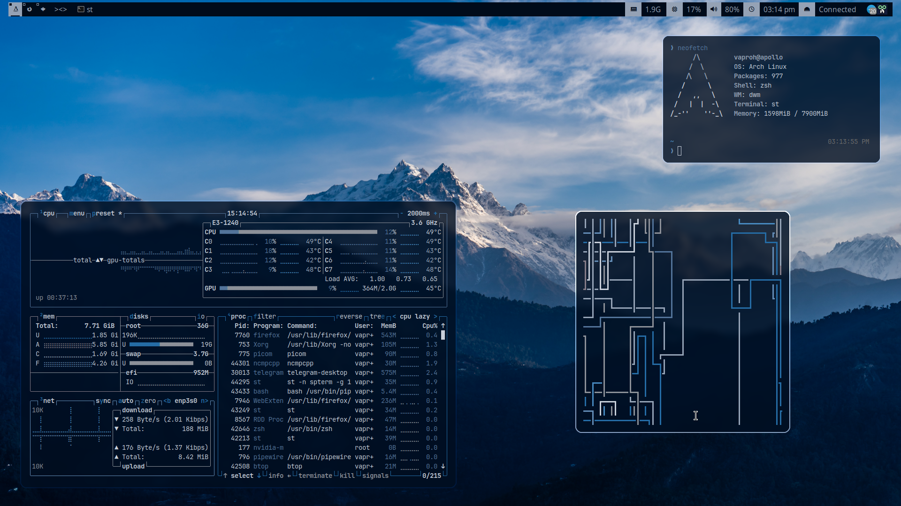
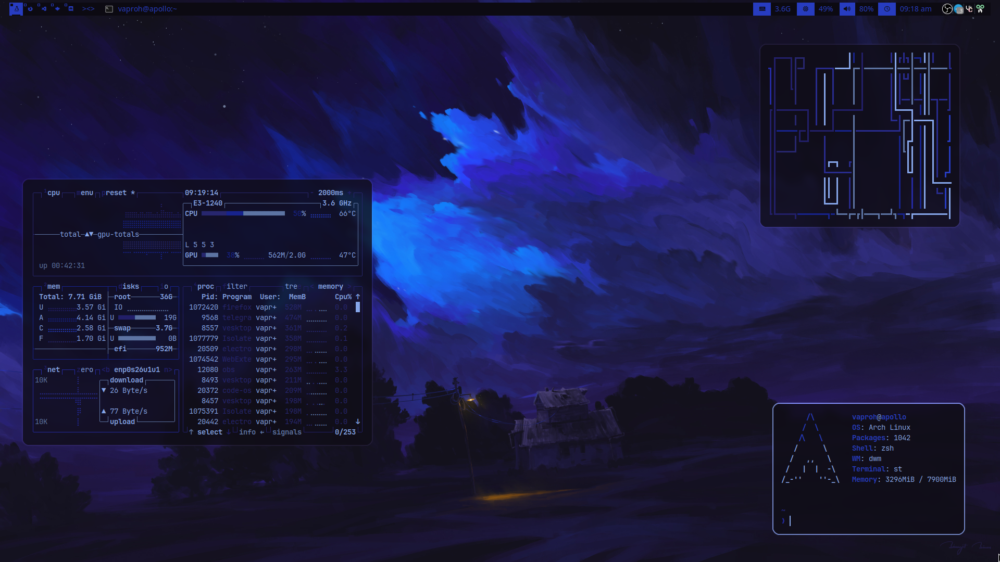

# Initial look

# Video overview

# Dependencies

1. imlib2
2. libxinerama
3. libxft

# Installation

1. Clone this repo
2. Compile it using this command (sudo make clean install)
3. Logout and login back
4. Enjoy!

